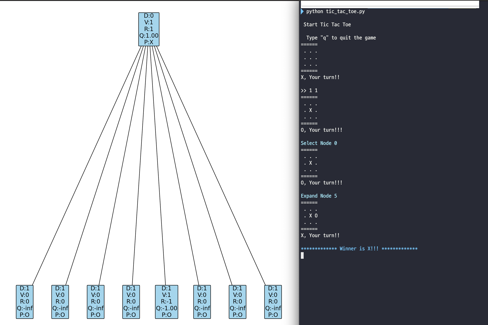
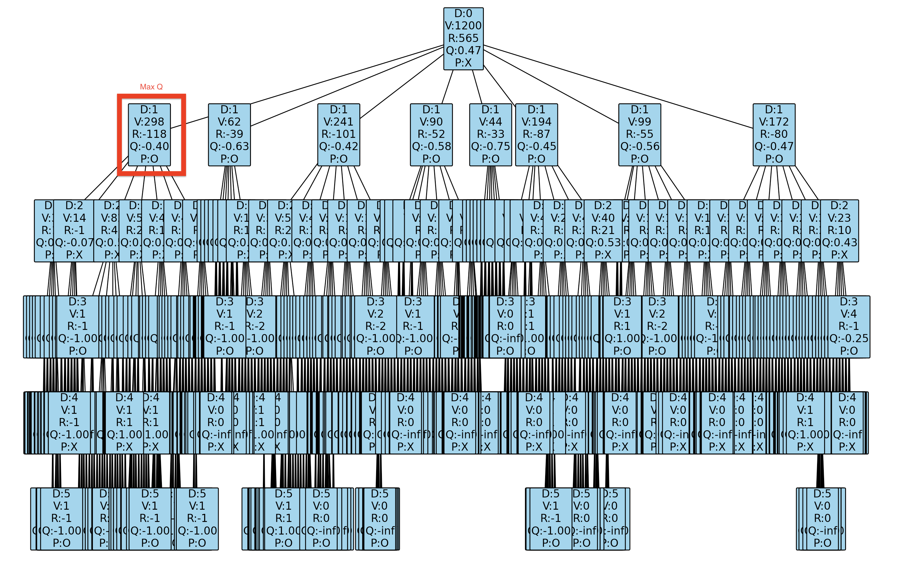
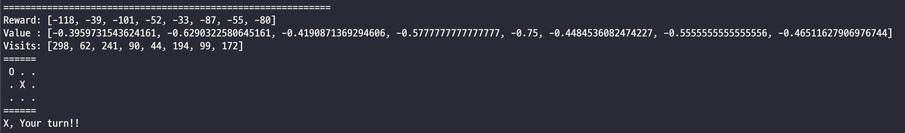

# Tic Tac Toe with MCTS

Let's play Tic Tac Toe game with MCTS

## Install

### Requirements

You need a [networkx](https://github.com/networkx/networkx) python library.

- Install the latest version of NetworkX

  ~~~shell
  $ pip install networkx
  ~~~

- Install with all optional dependencies

  ~~~shell
  $ pip install networkx[all]
  ~~~

- If you are a Mac OS user, you can use homebrew to install graphviz first

  ~~~shell
  $ brew install graphviz
  ~~~

  Check where is the output directory

  ~~~shell
  $ brew info graphviz
  ~~~

  In my cas, it was `/opt/homebrew/Cellar/graphviz/2.50.0`.

  Then run

  ~~~shell
  $ export GRAPHVIZ_DIR="/opt/homebrew/Cellar/graphviz/2.50.0"
  $ pip install pygraphviz --global-option=build_ext --global-option="-I$GRAPHVIZ_DIR/include" --global-option="-L$GRAPHVIZ_DIR/lib"
  ~~~

## How to use

~~~shell
$ cd src
$ python tic_tac_toe.py
~~~

## Example

| You can show Monte Carlo Tree graph. |
| ------------------------------------ |
|         |
|         |
|         |

D : Depth  
V : Visits  
R : Reward  
Q : R / V  
P : Player

## Reference

- Youtube : [Monte Carlo Tree Search algorithm](https://www.youtube.com/watch?v=UXW2yZndl7U)

- Demo page : [mcts-viz](https://vgarciasc.github.io/mcts-viz/)

- Blog : [Tic Tac Toe with MCTS](https://medium.com/swlh/tic-tac-toe-at-the-monte-carlo-a5e0394c7bc2)
